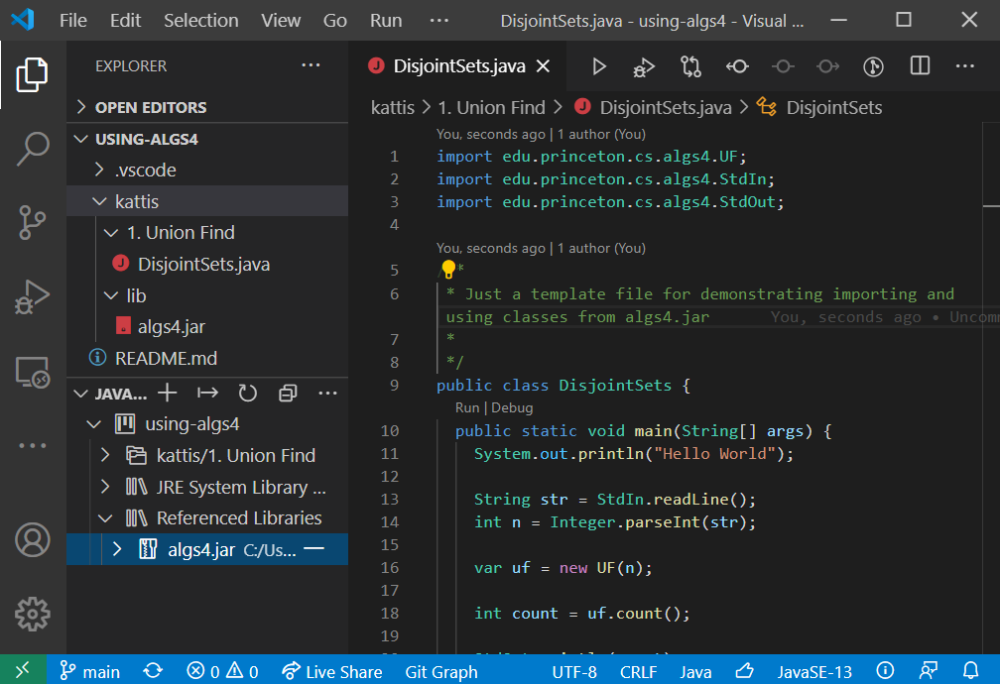

# Using algs4

## Windows and Java

### Option 1 - terminal command with manual classpath

With this option you need to reference `algs4.jar` every time, and use the command `java -cp algs4.jar myfile.java`

#### 1. Use the command
Put myfile.java and algs4.jar is in the same folder and use the command `java -cp algs4.jar myfile.java` (relative path)

or maybe place the jar inside a lib folder and use the command `java -cp lib/algs4.jar myfile.java` (relative path)

otherwise you might use a absolute path `java -cp C:\path\to\algs4.jar myfile.java` (absolute path)

### Option 2 - terminal command with global classpath

If you want to be able to import algs4 classes in any java file anywhere on your computer (globally), and use terminal command: `java myfile.java`, try this option.

#### 1. Add the variable `CLASSPATH` to Enviroment Variables:

The variables, *JAVA_HOME* and *value*, might already be set after installing java jdk.

Replace `\path\to\jdk-1.2.3.4` with your actual path to your [java jdk](https://github.com/AdoptOpenJDK/openjdk11-binaries/releases/latest)

Variable                | Value    
------------------------|----------
CLASSPATH               |   C:\path\to\algs4.jar
JAVA_HOME               |   C:\path\to\jdk-1.2.3.4\
path                    |   C:\path\to\jdk-1.2.3.4\bin\ *;some_other_unrelated_paths_you_shouldn't_mess_with*

#### 2. import from algs4 by adding this line to the top of your .java file `import edu.princeton.cs.algs4.*;`

#### 3. use `java myfile.java` to execute your program

## VS Code and Java

If you want to use a light weight IDE, as an alternative to IntelliJ, you might want to try VS Code

#### 1. Install [VS Code](https://code.visualstudio.com/)

#### 2. Create a folder structure

You can create a folder structure with:
1. a `lib/` folder for algs4.jar
2. a `.classpath` file with simply a single line `lib`

e.g.:

```
kattis/
├─── lib/
│    └─── algs4.jar
├─── MyProgram.java
├─── .classpath
```

#### 3. Install [java extension pack](https://marketplace.visualstudio.com/items?itemName=vscjava.vscode-java-pack)

You now should get IntelliSense (code suggestions) within VS Code and you can use the UI and `F5 key` (default keybinding) to run your java program.

**If you get no IntelliSense** try this in VS Code, press `ctrl+shift+p` and select the command `Java: Clean Java Language Server Workspace`.




